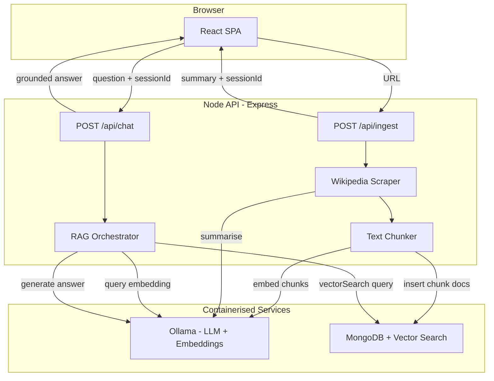

# Design

Architecture for a containerised RAG chat application over a single Wikipedia article, using a local LLM and **MongoDB with MongoDB Vector Search** for embedding storage and similarity retrieval.

---

## 1. High-Level Architecture



### ASCII Overview

```
┌─────────────┐     POST /api/ingest      ┌──────────────────────────────────┐
│  React SPA  │ ─────────────────────────► │         Express API              │
│             │                            │  ┌──────────┐  ┌─────────────┐  │
│  URL form   │     POST /api/chat         │  │ Scraper  │  │   Chunker   │  │
│  Summary    │ ─────────────────────────► │  └────┬─────┘  └──────┬──────┘  │
│  Chat box   │ ◄───────────────────────── │       │               │         │
└─────────────┘   summary / answer          │       ▼               ▼         │
                                            │  ┌─────────────────────────┐  │
                                            │  │    RAG Orchestrator     │  │
                                            │  └──────────┬──────────────┘  │
                                            └─────────────┼─────────────────┘
                                                          │
                              ┌───────────────────────────┼───────────────────────┐
                              ▼                           ▼                       ▼
                       ┌────────────┐            ┌──────────────────┐    ┌──────────┐
                       │   Ollama   │            │ MongoDB          │    │ In-memory│
                       │ LLM+Embed  │            │ Vector Search    │    │ Sessions │
                       └────────────┘            └──────────────────┘    └──────────┘
```

---

## 2. Component Breakdown

| Component | Responsibility | Planned Location |
|-----------|---------------|------------------|
| `frontend/` | URL form, summary display, chat UI | `frontend/src/App.tsx` |
| Ingest route | Validate URL, orchestrate scrape → summarise → index | `backend/src/routes/ingest.ts` |
| Chat route | Accept question, run RAG, return grounded answer | `backend/src/routes/chat.ts` |
| Wikipedia scraper | Fetch and parse article HTML via REST API | `backend/src/services/scraper.ts` |
| Text chunker | Split article into overlapping chunks with metadata | `backend/src/services/chunker.ts` |
| LLM client | Summarise and chat via Ollama | `backend/src/services/llm.ts` |
| Embeddings client | Generate vector embeddings via Ollama | `backend/src/services/embeddings.ts` |
| Vector store | Insert and `$vectorSearch` chunks in MongoDB | `backend/src/services/vectorStore.ts` |
| MongoDB client | Connection pooling, index management | `backend/src/services/mongodb.ts` |
| RAG orchestrator | Retrieve top-k chunks, build prompt, generate answer | `backend/src/services/rag.ts` |
| Session store | Track active article sessions in memory | `backend/src/services/sessionStore.ts` |

---

## 3. Data Flow: URL to Answered Question

### 3.1 Ingest Flow

```
User submits URL
    │
    ▼
Validate Wikipedia URL format
    │ (fail → 400 Bad Request)
    ▼
Scrape article via REST API + Cheerio
    │ (fail → 422 Unprocessable / empty → 404)
    ▼
Generate sessionId (UUID)
    │
    ├──► Summarise full text via Ollama (truncated to model context limit)
    │
    └──► Chunk text → embed via Ollama → insert into MongoDB `chunks` collection (tagged with sessionId)
    │
    ▼
Return { sessionId, title, summary } to frontend
```

### 3.2 Chat Flow

```
User submits { sessionId, message }
    │
    ▼
Validate sessionId exists
    │ (fail → 404 Session Not Found)
    ▼
Embed user question via Ollama
    │
    ▼
MongoDB $vectorSearch on `chunks` collection — filter by sessionId, top-5, min score threshold
    │ (no results above threshold → return "I cannot find that in the article.")
    ▼
Build RAG prompt with retrieved chunks as sole context
    │
    ▼
Generate answer via Ollama
    │
    ▼
Return { answer, sources: [{ sectionTitle, snippet }] }
```

---

## 4. Module Contracts

Interfaces are defined so the LLM runtime and vector store can be swapped without changing route or RAG logic.

```typescript
// LLM Provider (swappable: Ollama, vLLM, mock)
interface LlmProvider {
  summarise(text: string): Promise<string>;
  chat(system: string, user: string): Promise<string>;
}

// Embeddings Provider (swappable)
interface EmbeddingsProvider {
  embed(texts: string[]): Promise<number[][]>;
  readonly dimensions: number;
}

// Vector Store (swappable: MongoDB Vector Search, mock)
interface VectorStore {
  insertChunks(sessionId: string, chunks: Chunk[]): Promise<void>;
  vectorSearch(sessionId: string, vector: number[], topK: number): Promise<ScoredChunk[]>;
  deleteBySession(sessionId: string): Promise<void>;
}

// Scraper
interface Scraper {
  fetchArticle(url: string): Promise<Article>;
}

// Types
interface Article {
  title: string;
  url: string;
  sections: Section[];
  text: string;
}

interface Section {
  title: string;
  content: string;
}

interface Chunk {
  id: string;
  text: string;
  metadata: {
    sectionTitle: string;
    chunkIndex: number;
    sourceUrl: string;
  };
  vector?: number[];
}

interface ScoredChunk extends Chunk {
  score: number;
}
```

### API Contracts

**`POST /api/ingest`**

```json
// Request
{ "url": "https://en.wikipedia.org/wiki/Node.js" }

// Response 200
{
  "sessionId": "uuid",
  "title": "Node.js",
  "summary": "Node.js is a cross-platform..."
}

// Response 400 — invalid URL
{ "error": "URL must be a valid Wikipedia article link" }

// Response 422 — scrape failed
{ "error": "Could not retrieve article content" }
```

**`POST /api/chat`**

```json
// Request
{ "sessionId": "uuid", "message": "Who created Node.js?" }

// Response 200
{
  "answer": "Node.js was created by Ryan Dahl...",
  "sources": [
    { "sectionTitle": "History", "snippet": "..." }
  ]
}

// Response 404
{ "error": "Session not found. Please ingest an article first." }
```

---

## 5. Chunking Strategy

| Parameter | Value | Notes |
|-----------|-------|-------|
| Target chunk size | ~500 tokens (~2000 characters) | Fits multiple chunks in a 3B model context window |
| Overlap | ~50 tokens (~200 characters) | Preserves context across section boundaries |
| Split method | Recursive split on paragraph boundaries (`\n\n`), then sentence boundaries | Avoids mid-sentence cuts where possible |
| Metadata per chunk | `sectionTitle`, `chunkIndex`, `sourceUrl` | Enables source attribution in chat responses |

Chunks are embedded in batches (size configurable, default 10) to reduce round-trips to Ollama.

---

## 6. RAG Prompt Template

**System prompt:**

```
You are a helpful assistant that answers questions about a Wikipedia article.
Answer ONLY using the provided context excerpts. Do not use outside knowledge.
If the context does not contain enough information to answer, respond with:
"I cannot find that information in the article."
Keep answers concise and factual.
```

**User prompt:**

```
Context:
---
[Section: History]
{chunk text}
---
[Section: Features]
{chunk text}
---

Question: {user message}
```

**Retrieval parameters:**

| Parameter | Default | Purpose |
|-----------|---------|---------|
| `RAG_TOP_K` | 5 | Number of chunks passed to the LLM |
| `RAG_MIN_SCORE` | 0.7 | Minimum cosine similarity; below this, return "not found" |

---

## 7. Tech Stack Justification

| Choice | Why |
|--------|-----|
| **Node.js + Express + TypeScript** | Brief recommends Node; TypeScript enforces contracts between modules and improves testability. |
| **React + Vite** | Minimal SPA with fast HMR; no SSR complexity needed for a single-page app. |
| **Ollama + `llama3.2:3b`** | Runs on a developer laptop (~2 GB RAM); satisfies the local LLM hard requirement. Quality is acceptable for summarisation and Q&A on a single article. |
| **Ollama + `nomic-embed-text`** | Local embeddings (768 dimensions); no hosted API dependency; same runtime as the chat model. |
| **MongoDB + Vector Search** | Single database for chunk storage and similarity search; `$vectorSearch` aggregation with HNSW index; official `mongo` Docker image; session isolation via `sessionId` field filter. |
| **`mongodb` Node.js driver** | Official driver with native support for `$vectorSearch` aggregation pipelines; no extra vector-DB client library needed. |
| **Cheerio + Wikipedia REST API** | No headless browser; stable structured HTML from `en.wikipedia.org/api/rest_v1/page/html/{title}`. |
| **Vitest + Supertest** | Fast unit and integration tests; `@vitest/coverage-v8` for coverage reporting. |
| **Docker Compose** | Single-command startup; wires frontend, backend, MongoDB, and optionally Ollama. |

### AI Development Workflow

- **IDE**: Cursor (agent-driven planning and implementation).
- **Planning**: `REQUIREMENTS.md`, `DESIGN.md`, `TASKS.md` produced collaboratively in Cursor before any application code.
- **Implementation**: Tasks executed one-by-one per `TASKS.md`; human reviews architecture boundaries, RAG prompts, and test quality.

---

## 8. MongoDB Vector Search Design

### 8.1 Database & Collection

| Item | Value |
|------|-------|
| Database | `wikipedia_rag` |
| Collection | `chunks` |
| Driver | `mongodb` (official Node.js driver) |

### 8.2 Chunk Document Schema

```typescript
interface ChunkDocument {
  _id: ObjectId;
  sessionId: string;          // UUID — scopes chunks to one article ingest
  chunkId: string;            // unique within session
  text: string;               // chunk body
  embedding: number[];        // 768-dim vector from nomic-embed-text
  metadata: {
    sectionTitle: string;
    chunkIndex: number;
    sourceUrl: string;
  };
  createdAt: Date;
}
```

### 8.3 Vector Search Index

A **vector search index** is created on the `chunks` collection at startup (idempotent):

```json
{
  "name": "chunk_vector_index",
  "type": "vectorSearch",
  "definition": {
    "fields": [
      {
        "type": "vector",
        "path": "embedding",
        "numDimensions": 768,
        "similarity": "cosine"
      },
      {
        "type": "filter",
        "path": "sessionId"
      }
    ]
  }
}
```

- **Algorithm**: HNSW (MongoDB default for vector search indexes)
- **Similarity**: Cosine (matches `nomic-embed-text` output)
- **Dimensions**: 768 (matches `nomic-embed-text` embedding size)
- **Filter field**: `sessionId` enables pre-filtering so each query only searches the current article's chunks

### 8.4 Vector Search Query

Retrieval uses the `$vectorSearch` aggregation stage:

```typescript
db.collection('chunks').aggregate([
  {
    $vectorSearch: {
      index: 'chunk_vector_index',
      path: 'embedding',
      queryVector: queryEmbedding,
      numCandidates: 50,
      limit: topK,
      filter: { sessionId: { $eq: sessionId } }
    }
  },
  {
    $project: {
      text: 1,
      metadata: 1,
      score: { $meta: 'vectorSearchScore' }
    }
  }
]);
```

### 8.5 Index & Lifecycle Management

| Operation | Method |
|-----------|--------|
| Insert chunks on ingest | `insertMany()` with session-tagged documents |
| Search on chat | `$vectorSearch` aggregation filtered by `sessionId` |
| Cleanup on re-ingest | `deleteMany({ sessionId })` before inserting new chunks |
| Index creation | Run once on app startup via `createSearchIndex()` (idempotent) |

### 8.6 Docker Image Choice

Use `mongodb/mongodb-atlas-local` or `mongo:7.0` with search capabilities enabled. The compose file runs MongoDB as a containerised service with a named volume for data persistence. Vector search index creation is handled by the backend on startup.

---

## 9. Wikipedia Scraping Design

1. Parse the Wikipedia URL to extract the article title (handle `/wiki/Article_Title` format).
2. Reject non-Wikipedia domains and non-article paths (e.g. `/wiki/Special:`).
3. Fetch `https://en.wikipedia.org/api/rest_v1/page/html/{encodedTitle}`.
4. Parse HTML with Cheerio:
   - Extract article title from `<h1>`.
   - Walk `<section>` elements for section headings and body text.
   - Strip references, navboxes, and infoboxes where reasonable.
   - Concatenate into a flat `text` field for summarisation/chunking.
5. Return early with an error if the response is empty or the title cannot be parsed.

---

## 10. Docker Compose Layout

```yaml
services:
  frontend:
    # nginx serving Vite production build
    # proxies /api/* → backend:3000
    ports: ["8080:80"]

  backend:
    # Node.js Express API
    ports: ["3000:3000"]
    environment:
      - OLLAMA_BASE_URL=http://host.docker.internal:11434
      - MONGODB_URI=mongodb://mongodb:27017/wikipedia_rag
    depends_on: [mongodb]

  mongodb:
    image: mongodb/mongodb-atlas-local:latest
    ports: ["27017:27017"]
    volumes: [mongodb_data:/data/db]
    # mongodb-atlas-local includes Vector Search support for local development.
    # Alternative: mongo:7.0 with search index support.

  # ollama:
  #   image: ollama/ollama:latest
  #   ports: ["11434:11434"]
  #   volumes: [ollama_data:/root/.ollama]
  # Uncomment if running Ollama in-container.
  # Default: connect to host-side Ollama via host.docker.internal.

volumes:
  mongodb_data:
```

**Startup command:** `docker compose up`

**Prerequisites (host-side Ollama, default approach):**

```bash
ollama pull llama3.2:3b
ollama pull nomic-embed-text
```

---

## 11. Environment Variables

Defined in `.env.example` (no secrets committed):

| Variable | Default | Description |
|----------|---------|-------------|
| `OLLAMA_BASE_URL` | `http://localhost:11434` | Ollama API endpoint |
| `OLLAMA_MODEL` | `llama3.2:3b` | Chat and summarisation model |
| `OLLAMA_EMBED_MODEL` | `nomic-embed-text` | Embedding model (768 dimensions) |
| `MONGODB_URI` | `mongodb://localhost:27017/wikipedia_rag` | MongoDB connection string |
| `MONGODB_DB_NAME` | `wikipedia_rag` | Database name |
| `MONGODB_CHUNKS_COLLECTION` | `chunks` | Collection storing chunk documents with embeddings |
| `MONGODB_VECTOR_INDEX` | `chunk_vector_index` | Vector search index name |
| `CHUNK_SIZE` | `2000` | Target chunk size in characters |
| `CHUNK_OVERLAP` | `200` | Overlap in characters |
| `RAG_TOP_K` | `5` | Retrieved chunks per query |
| `RAG_MIN_SCORE` | `0.7` | Minimum vector search score threshold |
| `PORT` | `3000` | Backend listen port |

---

## 12. Error Handling

| Scenario | HTTP Status | User-Facing Message |
|----------|-------------|---------------------|
| Missing or malformed URL | 400 | "URL must be a valid Wikipedia article link" |
| Non-Wikipedia domain | 400 | "Only Wikipedia article URLs are supported" |
| Article not found / empty | 404 | "Article not found or has no readable content" |
| Scrape network failure | 422 | "Could not retrieve article content" |
| Ollama unreachable | 503 | "LLM service unavailable. Please try again." |
| MongoDB unreachable | 503 | "Database unavailable. Please try again." |
| Vector search index missing | 503 | "Vector search index not ready. Please try again." |
| Invalid sessionId on chat | 404 | "Session not found. Please ingest an article first." |
| No relevant chunks for question | 200 | "I cannot find that information in the article." |

---

## 13. Testing Strategy

| Layer | Approach |
|-------|----------|
| **Unit tests** | Mock `LlmProvider`, `EmbeddingsProvider`, `VectorStore`, and HTTP fetch. Test scraper parsing, chunker splitting, RAG prompt building, route validation. |
| **Integration test** | At least one test wiring real MongoDB with Vector Search (Docker or `mongodb-memory-server` with mocked `$vectorSearch`) and mocked or real Ollama. Exercises ingest → chat end-to-end. |
| **Coverage** | Vitest with `@vitest/coverage-v8`. Target ≥85% on `backend/src/`. Exclude entry/bootstrap files per brief FAQ. |
| **Coverage report** | Generated via `npm run test:coverage`; HTML report committed to `coverage/` or screenshot in repo. |

---

## 14. Known Limitations

- **Single article per session** — no multi-article history or cross-session persistence.
- **In-memory session metadata** — server restart clears session map (title/summary); chunk documents remain in MongoDB until explicitly deleted.
- **Vector search index warmup** — index creation on first startup may take a few seconds; health check should account for this.
- **English Wikipedia only** — scraping targets `en.wikipedia.org` REST API.
- **3B model quality** — summarisation and answers may be less nuanced than larger models; documented as an accepted trade-off.
- **No streaming** — chat responses are returned as complete strings, not token streams.
